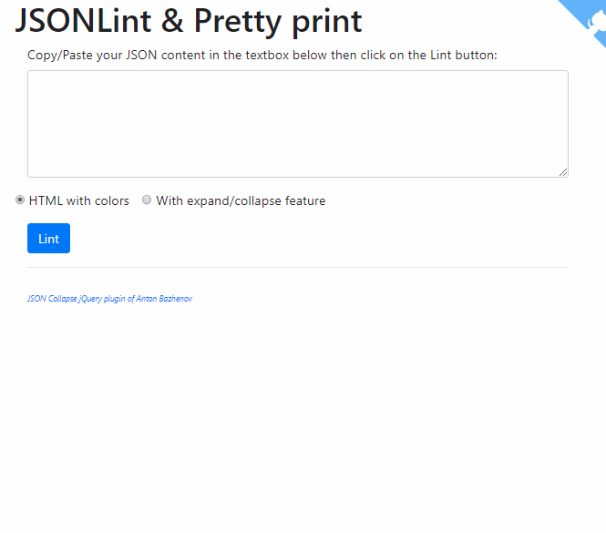

# jsonlint

JSONLint is a simple and fast interface to check the quality of a JSON string and display it in a readable and colorful format.

JSONLint will try to solve basic errors like JSON key without quotes.

## How to use

Just copy/paste your JSON string into the text box as illustrated here below.

Make a choice between: do you want a HTML return with things put in colors (keys and values) or a hierarchic view where you'll be able to collapse or expand levels.

Linting will be made automatically; without the need to click on a button.

### Invalid JSON

When the string is invalid like in `{hello:"world","places":["Africa","America","Asia","Australia"]}` (keys are not inside double-quotes), the interface try to solve this issue by itself. If successfull, the JSON will be rewritten and, then, linted.

## Full javascript

Everything is done on client side by Javascript. There is no more interaction with your server once the form is displayed.

## Helpers

- The javascript code used for color syntax has been found here: https://stackoverflow.com/a/7220510/1065340
- jQuery plugin for showing JSON with expand / collapse feature can be found here: https://github.com/bazh/jquery.json-view
