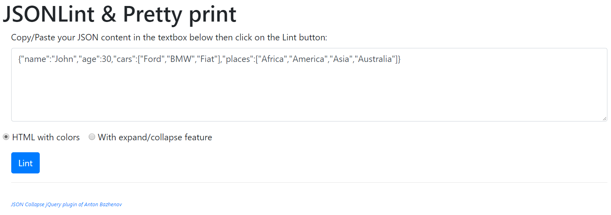
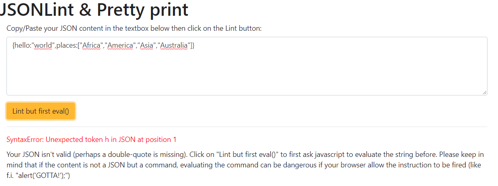
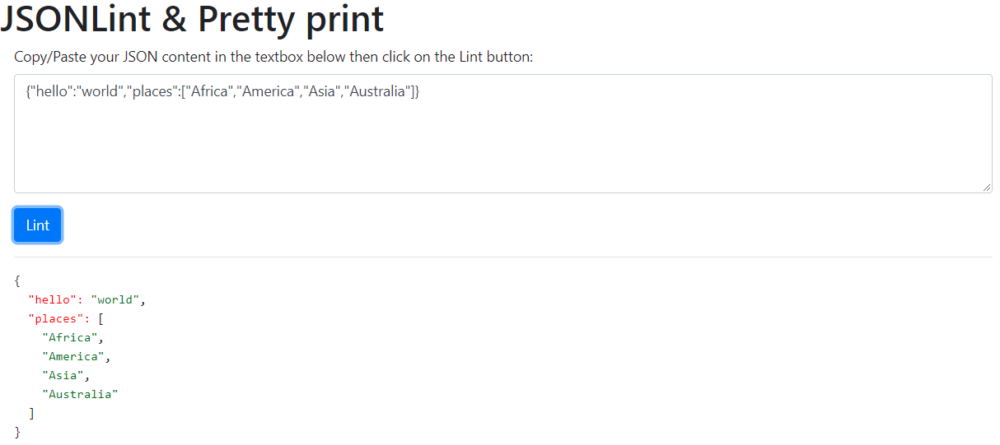

# jsonlint

JSONLint is a simple and fast interface to check the quality of a JSON string and display it in a readable and colorful format.

JSONLint will try to solve basic errors like JSON key without quotes.

## How to use

Just copy/paste your JSON string into the text box as illustrated here below and press the `Lint` button. If the string is valid, you'll immediately see the result below the `Lint` button.

When the string is invalid like in `{hello:"world","places":["Africa","America","Asia","Australia"]}` (keys are not inside double-quotes), the interface will notify you about the error and suggest to, first, make an `eval()`.

By clicking once more on the `Lint` button, Javascript will thus first `eval()` the string and try to convert it in a valid JSON object. If this can be done, the input string will be reseted to the correct value and you'll get the pretty version below the button like illustrated below.

Note: except for displaying the form (with PHP), everything is done on client side by Javascript. There is no more interaction with your server once the form is displayed.

## Helpers

The javascript code used for color syntax has been found here : https://stackoverflow.com/a/7220510/1065340
