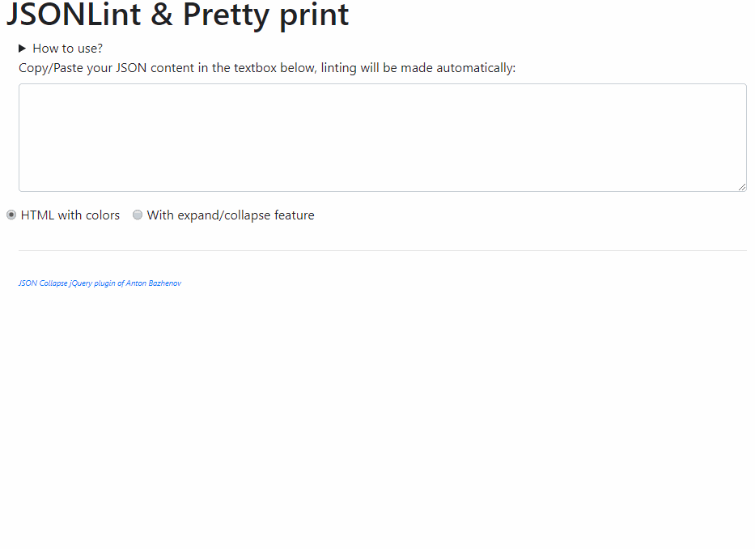

# jsonlint

JSONLint is a simple and fast interface to check the quality of a JSON string and display it in a readable and colorful format.

JSONLint will try to solve basic errors like JSON key without quotes.

## How to use

Just copy/paste your JSON string into the text box as illustrated here below.

Make a choice between: do you want a HTML return with things put in colors (keys and values) or a hierarchic view where you'll be able to collapse or expand levels.

When the choice is made, press the `Lint` button.

### Invalid JSON

When the string is invalid like in `{hello:"world","places":["Africa","America","Asia","Australia"]}` (keys are not inside double-quotes), the interface will notify you about the error and suggest to, first, make an `eval()`.

By clicking once more on the `Lint` button, Javascript will thus first `eval()` the string and try to convert it in a valid JSON object. If this can be done, the input string will be updated to the correct value and you'll get the pretty version.

Note: except for displaying the form (with PHP), everything is done on client side by Javascript. There is no more interaction with your server once the form is displayed.

## Helpers

- The javascript code used for color syntax has been found here: https://stackoverflow.com/a/7220510/1065340
- jQuery plugin for showing JSON with expand / collapse feature can be found here: https://github.com/bazh/jquery.json-view
